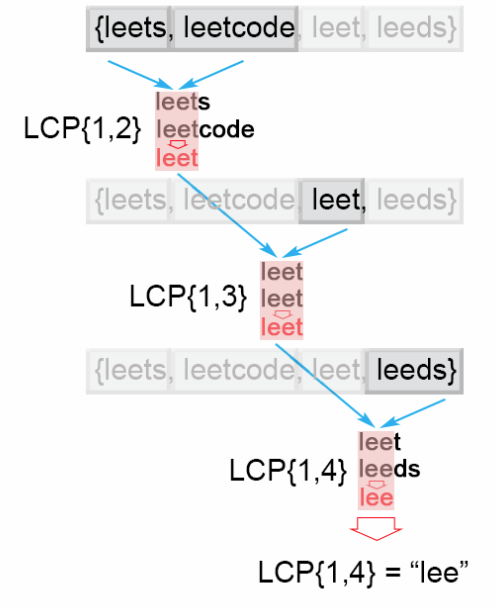
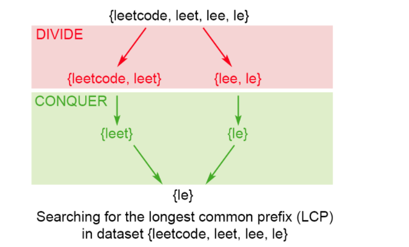
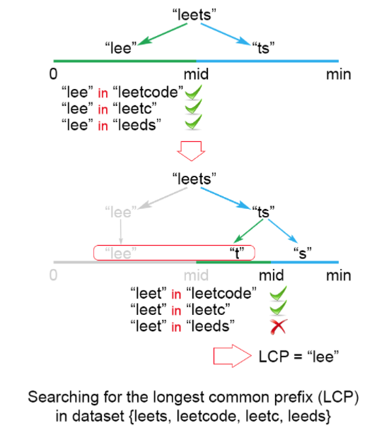

## longest-common-prefix
> 题目
Write a function to find the longest common prefix string amongst an array of strings.

If there is no common prefix, return an empty string "".

**Example 1:**
```js
Input: ["flower","flow","flight"]
Output: "fl"
```

## 解法一.：Horizontal scanning
其解题思路见下图：




## 解法二：Vertical scanning
与解法一思路类似，不赘述了


## 解法三：Divide and conquer
其解题思路见下图：




## 解法四：Binary search
其解题思路见下图：

